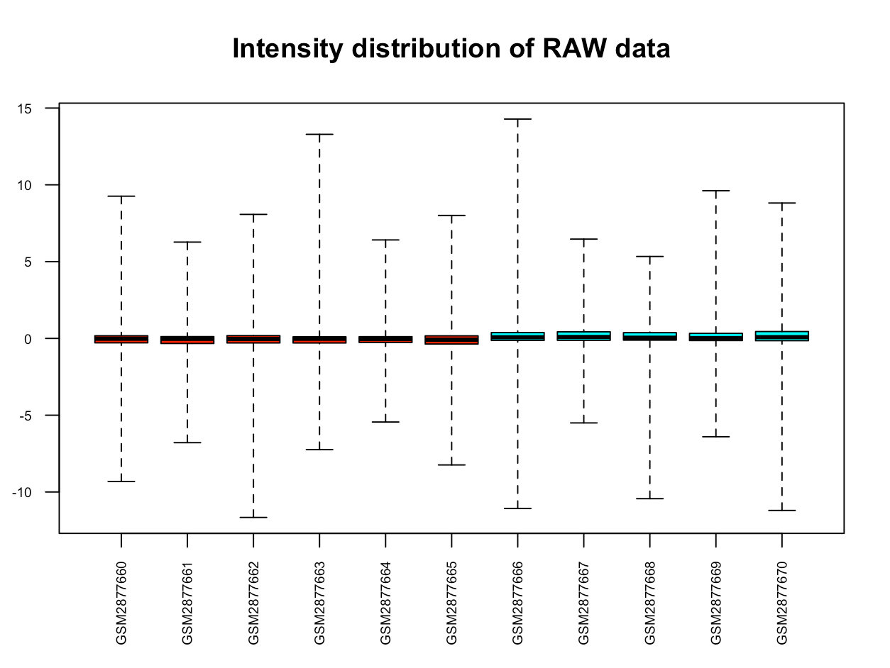
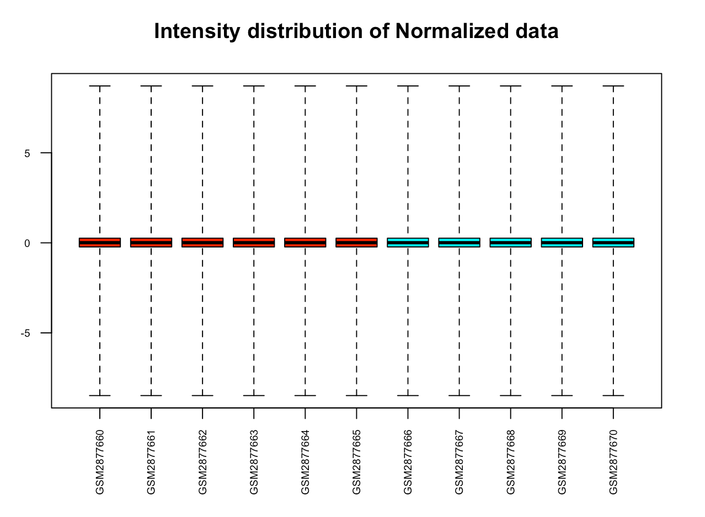
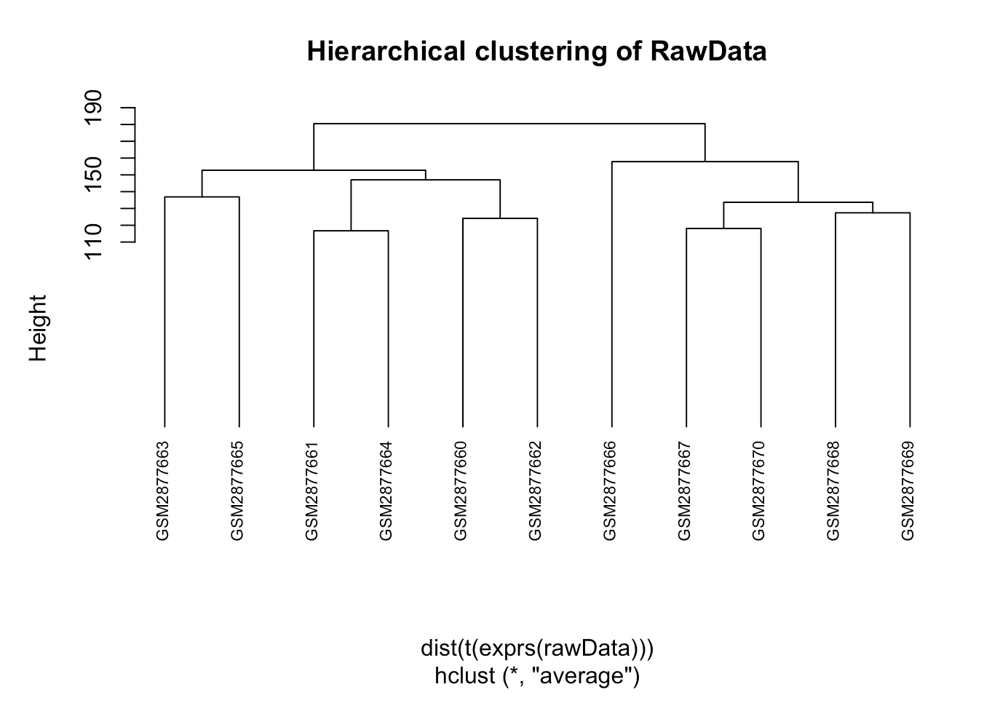
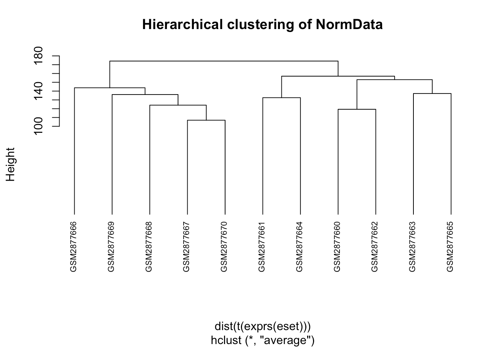
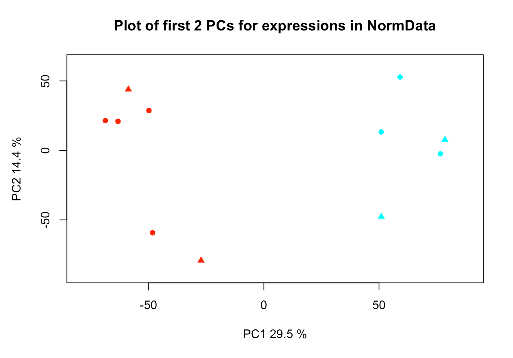
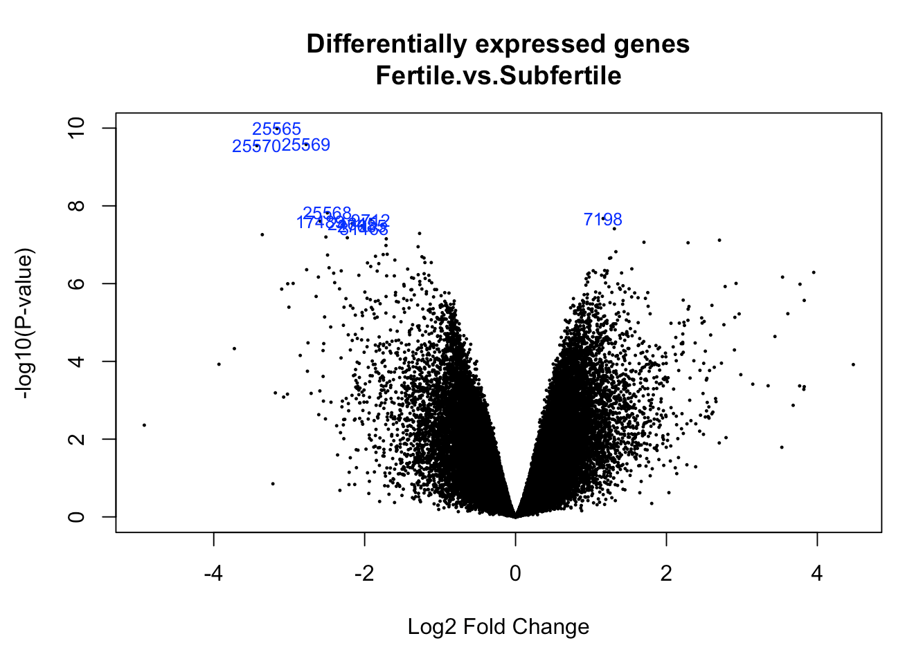

```{r setup, include=FALSE}
knitr::opts_chunk$set(echo = TRUE)
```

Link to repository: https://github.com/JuditCamps/Camps_Judit-OmicsTechniques.git

# Abstract
The data used has been taken for this study is from the experiment titled *Endometrial gene expression in fertile and subfertile cows* which was made on the Bos taurus organism. The main aim of the experiment was to clarify the cause of reproductive failure in this species.

# Objectives
The objective is to study the data that was obatined in the experiment through the expression matrices and the expression set. This is done in order to check that these data obtained is correct and to check for significant genes. 

# Materials and methods
The expression profiling of the experiment data was made by array. The data which has been used for the study is:

- A data frame with the targets.

- An expression matrix with the expression of each target.


```{r}
workingDir <-getwd()
dataDir <- file.path(workingDir, "GSE107741/data")
resultsDir <- file.path(workingDir, "GSE107741/results")


if (!require(BiocManager)) install.packages("BiocManager")

installifnot <- function (pkg){
  if (!require(pkg, character.only=T)){
    BiocManager::install(pkg)
}else{
  require(pkg, character.only=T)
  }
}

installifnot("pd.mogene.1.0.st.v1")
installifnot("mogene10sttranscriptcluster.db")
installifnot("oligo")
installifnot("limma")
installifnot("Biobase")
installifnot("arrayQualityMetrics")
installifnot("genefilter")
installifnot("multtest")
installifnot("annotate")
installifnot("xtable")
installifnot("gplots")
installifnot("scatterplot3d")
```


### Data capture
The first step was to capture the data of the experiment. The target file and the expression matrix were imported.
```{r}
targets <- read.delim("~/Documents/BDBI/2n/3r_trim/Omics_Techniques/Camps_Judit-OmicsTechniques/Exercise_3/GSE107741/data/targets.txt")
class(targets)
print(targets)
```

```{r}
expression <- as.matrix(read.delim("~/Documents/BDBI/2n/3r_trim/Omics_Techniques/Camps_Judit-OmicsTechniques/Exercise_3/GSE107741/data/expression.txt", row.names=1, comment.char="#"))
class(expression)
head(expression)
```

Then I had to obtain the raw data. To do so, we could use the CEL files, but as in this case they aren't used, I used the expression set as the raw data. To do so, I


# Creating the Expression set:

```{r}
if (!require(GEOquery)) {
  BiocManager::install("GEOquery")
}
require(GEOquery)
gse <- getGEO("GSE107741")
class(gse)
names(gse)

rawData <- gse[[1]]

names(pData(rawData))
``` 


### Quality assessment of the raw data
After generating the expression set, we check the quality of the obtained data.
We can define some variables for the plots:

```{r}
colnames(rawData) <-rownames(pData(rawData)) <- targets$SampleName
sampleNames <- as.character(targets$SampleName)
sampleColor <- as.character(targets$Colors)
```

We generate a boxplot:

```{r}
#BOXPLOT
boxplot(rawData, which="all",las=2, main="Intensity distribution of RAW data", 
        cex.axis=0.6, col=sampleColor, names=sampleNames)

```

We do a hierarquical clustering:
```{r}
#HIERARQUICAL CLUSTERING
clust.euclid.average <- hclust(dist(t(exprs(rawData))),method="average")
plot(clust.euclid.average, labels=sampleNames, main="Hierarchical clustering of RawData", 
     cex=0.7,  hang=-1)
```

And a principal component analysis:

```{r}
#PRINCIPAL COMPONENT ANALYSIS
plotPCA <- function ( X, labels=NULL, colors=NULL, dataDesc="", scale=FALSE, formapunts=NULL, myCex=0.8,...)
{
  pcX<-prcomp(t(X), scale=scale) # o prcomp(t(X))
  loads<- round(pcX$sdev^2/sum(pcX$sdev^2)*100,1)
  xlab<-c(paste("PC1",loads[1],"%"))
  ylab<-c(paste("PC2",loads[2],"%"))
  if (is.null(colors)) colors=1
  plot(pcX$x[,1:2],xlab=xlab,ylab=ylab, col=colors, pch=formapunts, 
       xlim=c(min(pcX$x[,1])-100000, max(pcX$x[,1])+100000),ylim=c(min(pcX$x[,2])-100000, max(pcX$x[,2])+100000))
  text(pcX$x[,1],pcX$x[,2], labels, pos=3, cex=myCex)
  title(paste("Plot of first 2 PCs for expressions in", dataDesc, sep=" "), cex=0.8)
}

plotPCA(exprs(rawData), labels=targets$sampleNames, dataDesc="raw data", colors=sampleColor,
        formapunts=c(rep(16,4),rep(17,4)), myCex=0.6)
```

### Normalization of the raw data
We need to normalize the data. To do so we could use the rma function.
```{r}
# eset_rma <- rma(rawData)
```
But in my case it didn't work, but I found another function in order to do so:

```{r}
BiocManager::install("affydata")
eset <- normalize(rawData)
```

### Quality assessment of the normalized data
Now we check the quality of the normalized data, firstly by doing a boxplot:

```{r}
#BOXPLOT
boxplot(eset, las=2, main="Intensity distribution of Normalized data", cex.axis=0.6, 
        col=sampleColor, names=sampleNames)
```


We can also do a hierarquical clustering of the normalized data:
```{r}
#HIERARQUICAL CLUSTERING

clust.euclid.average <- hclust(dist(t(exprs(eset))),method="average")
plot(clust.euclid.average, labels=sampleNames, main="Hierarchical clustering of NormData", 
     cex=0.7,  hang=-1)
```

And as we did for the raw data, we can also do a principal component analysis:

```{r}
#PRINCIPAL COMPONENT ANALYSIS

plotPCA <- function ( X, labels=NULL, colors=NULL, dataDesc="", scale=FALSE, formapunts=NULL, myCex=0.8,...)
{
  pcX<-prcomp(t(X), scale=scale) # o prcomp(t(X))
  loads<- round(pcX$sdev^2/sum(pcX$sdev^2)*100,1)
  xlab<-c(paste("PC1",loads[1],"%"))
  ylab<-c(paste("PC2",loads[2],"%"))
  if (is.null(colors)) colors=1
  plot(pcX$x[,1:2],xlab=xlab,ylab=ylab, col=colors, pch=formapunts, 
       xlim=c(min(pcX$x[,1])-10, max(pcX$x[,1])+10),ylim=c(min(pcX$x[,2])-10, max(pcX$x[,2])+10))
  text(pcX$x[,1],pcX$x[,2], labels, pos=3, cex=myCex)
  title(paste("Plot of first 2 PCs for expressions in", dataDesc, sep=" "), cex=0.8)
}
```
```{r}
plotPCA(exprs(eset), labels= targets$sampleNames, dataDesc="NormData", colors=sampleColor,
        formapunts=c(rep(16,4),rep(17,4)), myCex=0.6)
```


### Identification of differentially expressed genes
In order to identify the genes that are differentialy expressed, the lima package is required.
```{r}

require (limma)
```

#### Linear models and comparisons
We'll need to create a contast matrix with the linear model of the data. We'll also need a comparison matrix, which will contain the comparisons between the differnet groups data, so in this case there will only be one comparison as we only have two types of samples. And we'll also fit the model
```{r}
#CONTRAST MATRIX.lINEAR MODEL
treat <- targets$Type
lev <- factor(treat, levels = unique(treat))
design <-model.matrix(~0+lev)
colnames(design)<-c("Fertile", "Subfertile")
rownames(design) <- targets$SampleName 
print(design)

#COMPARISON
cont.matrix1 <- makeContrasts (
  Fertile.vs.Subfertile = Fertile-Subfertile,
  levels=design)
comparison1 <- "Effect of Induction"
```

The matrices could also be generated this way:

```
##### Design matrix

design<-matrix(
  c(1,1,1,1,1,1,0,0,0,0,0,
    0,0,0,0,0,0,1,1,1,1,1),
  nrow=11,byrow=F)
design2 <-model.matrix(~ 0+targets$Type) #We put a 0 as there isn't an intercept
colnames(design)<- colnames(design2)<-c("Fer", "Subfer")
rownames(design) <- rownames(design2)<- targets$SampleName 
print(design); print(design2)


##### Contrast matrix

cont.matrix <- makeContrasts (
  FerSub = Fer-Subfer,
  levels=design)
```

```{r}
#MODEL FIT
fit1 <- lmFit(eset, design)
fit.main1 <- contrasts.fit(fit1, cont.matrix1)
fit.main1 <- eBayes(fit.main1)
```


#### Toptables

```{r}
#FILTER BY FALSE DISCOVERY RATE AND FOLD CHANGE
topTab <-  topTable (fit.main1, number=nrow(fit.main1), coef="Fertile.vs.Subfertile", adjust="fdr",lfc=abs(3))
```


#### Volcano plots
In order to visualize those genes that might be differentially expressed, we can do it through volcano plots.

```{r}
volcanoplot(fit.main1, highlight=10, names=fit.main1$ID, 
            main = paste("Differentially expressed genes", colnames(cont.matrix1), sep="\n"))

```


### Data annotation
To annotate the data, we use BiocManager to install the necessary package.

In my case I tried installing different packages but in all the cases they didn't work properly. I installed different versions of the complete genome for Bos taurus. The packages were:

- MeSH.Bta.eg.d

- TxDb.Btaurus.UCSC.bosTau8.refGene

We would have to continue with something like this:
```
BiocManager::install("MeSH.Bta.eg.db")
require(MeSH.Bta.eg.db)

ls("package:MeSH.Bta.eg.db")

all_anota<-data.frame(exprs(eset))
contents(MeSH.Bta.eg.db)
Annot <- data.frame(SYMBOL=sapply(contents(MeSH.Bta.egSYMBOL), paste, collapse=", "),
                    DESC=sapply(contents(MeSH.Bta.egGENENAME), paste, collapse=", "),
                    UNIPROT=sapply(contents(MeSH.Bta.egUNIPROT), paste, collapse=", "))
Annot<-Annot[!Annot$SYMBOL=="NA",]
Annot<-Annot[!Annot$DESC=="NA",]
head(Annot)

anotaGenes <- merge(Annot,all_anota, by.x=0,by.y=0)
head(anotaGenes)
write.table(anotaGenes, file ="data.ann.txt",sep="\t")

rownames(anotaGenes) <- anotaGenes[,1]
anotaGenes <- anotaGenes[,-1]
anotaGenes.end <- merge(anotaGenes, topTab, by.x=0,by.y=0)
#reordenamos las columnas
topTab.end <- anotaGenes.end[,c(1:3,12:17,4:11)]
topTab.end <- topTab.end[order(-topTab.end$B),]

rownames(topTab.end) <- topTab.end[,1]
topTab.end <- topTab.end[, -1]
write.csv(topTab.end, file = file.path(resultsDir,"TopTable.end.csv"))


probesAvsB <- rownames(topTab_AvsB)[1:10]
anotAvsB <- select(hgu133a.db, probesAvsB, columns = c("ENTREZID", "SYMBOL", "GENENAME"))
```


# Results
Here we can see the differences from the boxplots of the raw data and the normalized data:





If we also compare the clusterings of the raw data and the normalized data, we can see some differences in the clusters:



Once we have normalized the data, we can see the PCA plot which shows a difference between fertile cows (that can be seen in red) and those that are subfertile (seen in blue).




With the PCA plot of the normalized data we can see that there is a separation between both groups (fertile and subfertile):



With the volcano plots we are plotting the significance versus the fold-change of the data replicates. Those data points that have a low p-value, and so are significant, will appear on the top of the plot. In this case we can see that we obtain some significant genes.



# Conclusions
We can say that, as shown in the previous plots, there is the existance of some genes that may lead to having different types of cows that might be fertile or subfertile. These genes are those shown in the volcano plot as significant.


